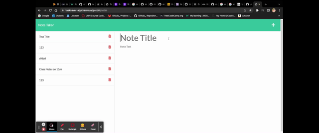

# tasksaver-note-taker

## License:

---

## Table of Contents:
* [License](#license)
* [Purpose](#purpose)
* [Usage](#usage)
* [Knowledge](#knowledge)
* [Demo Video](#demo-video)
* [Deployed URL](#deployed-url)
* [Questions](#questions)
---
## Purpose: 
### Apply express.js to create backend platform for user's to save notes.
To create an application called `Tasksaver Note Taker` to be able to write and save notes for a small business owner to organize their business thoughts.

---
## Usage:
This note taker application is designed to write and save notes for a small business. 
How to use it- Clicking on top right-hand corner `+` to start typing your `Note Title` and then, typing your `Note Text` to in order to save your notes by clicking on top right-hand corner `Save Button` to save our notes.

---
## Knowledge: 
* `JavaScript`
* `Node.js`
* `Express.js`
* `node server` to get server URl
* Installation: Run `npm install` to install the packages and dependencies.

---
## Demo Video: 

---

## Required to submit the following URL for review:
## Deployed URL:
* Github URL:
https://github.com/Joyce750526/tasksaver-note-taker

* Github Deployed Page: 
https://joyce750526.github.io/tasksaver-note-taker/

* Heroku Deployed Page: 
https://tasksaver-app.herokuapp.com/
---

## Questions:
If you have any questions about this projects, please contact me!
Email: [joyceideas@outlook.com](mailto:joyceideas@outlook.com)
Github: [joyce750526](https://github.com/joyce750526)

---
Chao-Ying (Joyce) Chen

